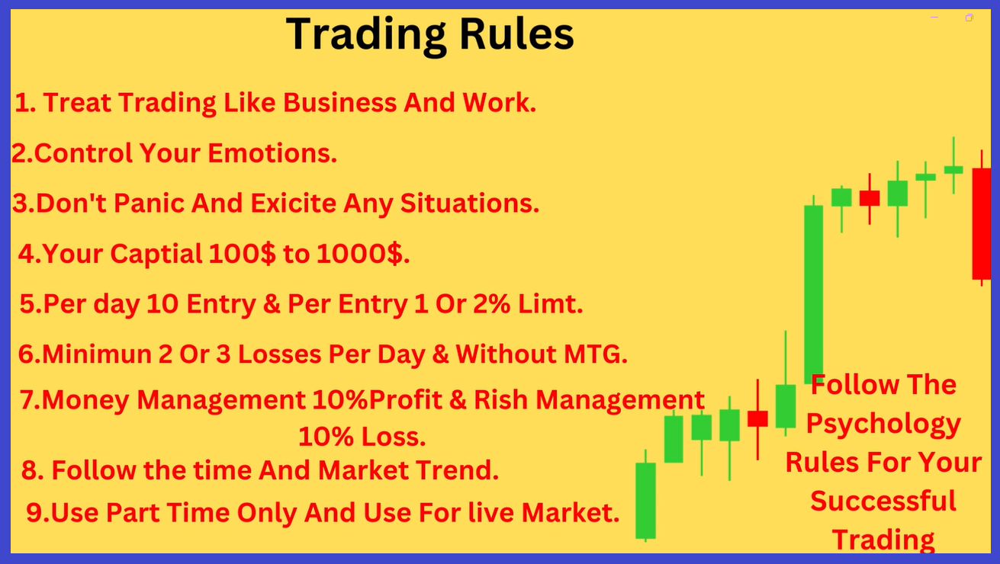

# Trader Must do

- Learning (Spend time to learn)
- Paper trading (Spend time to learn)
- Emotional Control
- Manage Funds & Timing
- Start with small
- Strict with your plan
- Trading Platform is important (Clear chart vision)
- Trade when opportunity is there

# Don't do

- Don't Borrow
- Use surplus amount

## Decide

- Investor or trader
- `Short term` or `long term`(go with mutual funds) or `intraday`

## Learn and trade

- Short term trader - Fundamental, technical
- Long term trader - Fundamental
- Intraday term trader - News, technical

> Avoid penny stocks
> Keep your egg in different bucket
> Don't follow other people stragies if may be work

# Trading rules

