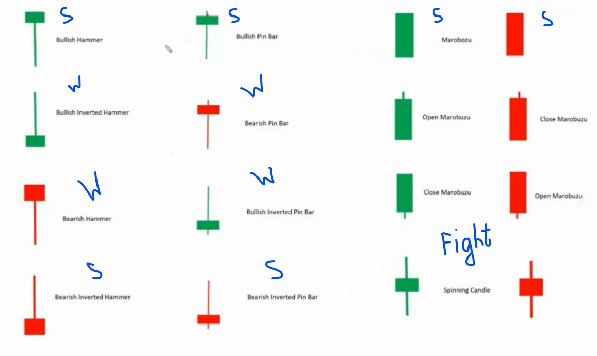

# Candlesticks

## What ?

## Wick Reading

- Top wick of buyers candles represents `sellers here`.
- Bottom wick of buyers candles represents `buyers here`.
- So First candle is `weak` compare to second candle.

> wick or pressure or rejection

- Note this

## Name

- **Hanging Man and Hammer**, **Shooting star and Inverted Hammer** are same pattern
- Hanging Man and Shooting star form in `Top`
- Hammer and Inverted Hammer form in `Bottom`

> It's only applicable in live market
