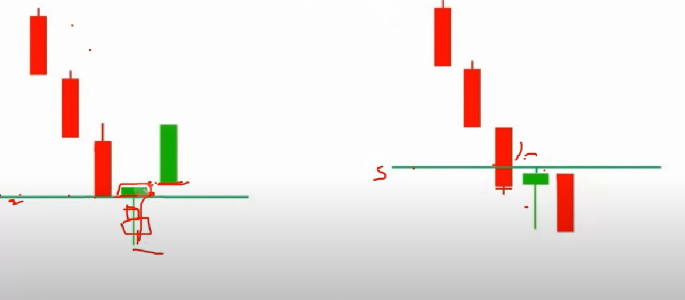
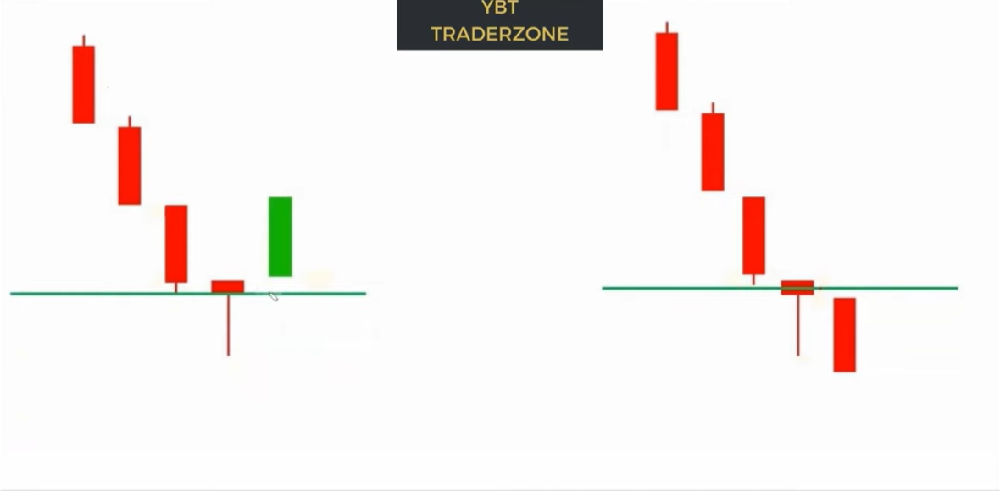
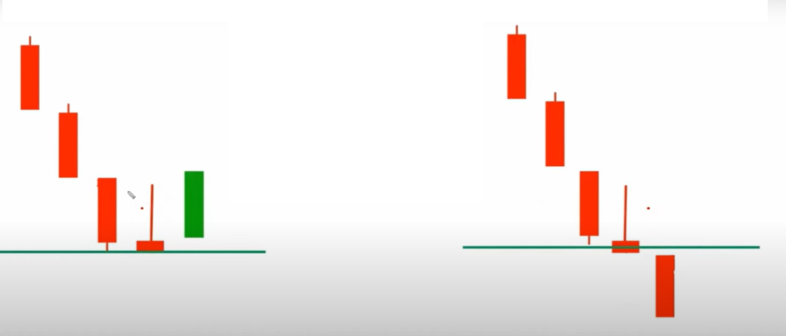
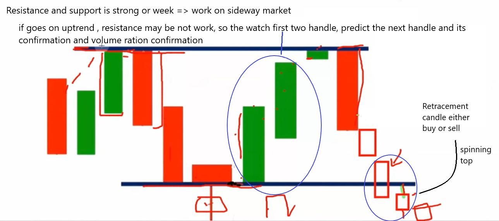

# Support and Resistance

## Bullish

| Description                                           | Entry |
| ----------------------------------------------------- | ----- |
| Exactly close at support and buying pressure hammer   | buy   |
| Breakdown the support and exactly close at resistance | sell  |

## Bearish (same as before)

| Description                                                                  | Entry |
| ---------------------------------------------------------------------------- | ----- |
| Buying pressure hammer (seller handle) and Exactly close at support          | buy   |
| Breakdown the support (Jump up gap down) and **`closing below the support`** | sell  |

## Inverted Bearish

| Description                                                                                      | Entry |
| ------------------------------------------------------------------------------------------------ | ----- |
| Selling pressure inverted hammer (seller handle) but Exactly close at support                    | buy   |
| Breakdown the support (Strong seller handle) and **`closing below the support`** so continuation | sell  |

# Mark the support and Resistance

