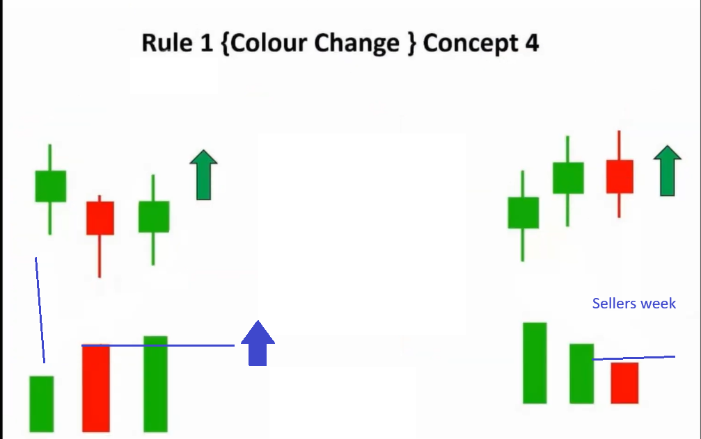

# Volume Analysis

> Applicable for live market

## Volume

- Volume means power of wicks
- If high volume then wick is power and vice versa

## Volume Types

### variation

## Rules

### Rule 1

### Rule 2

