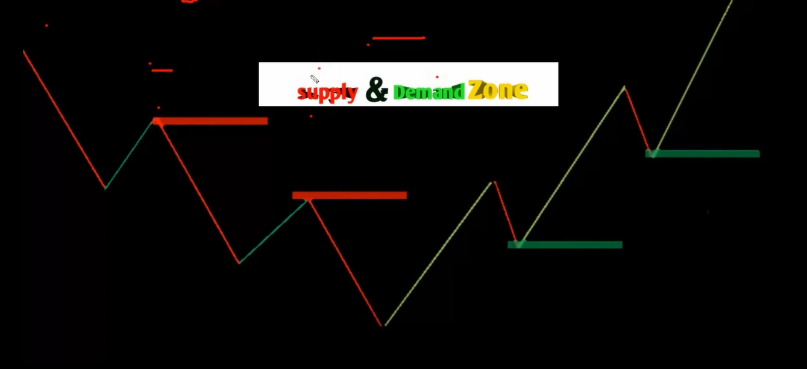
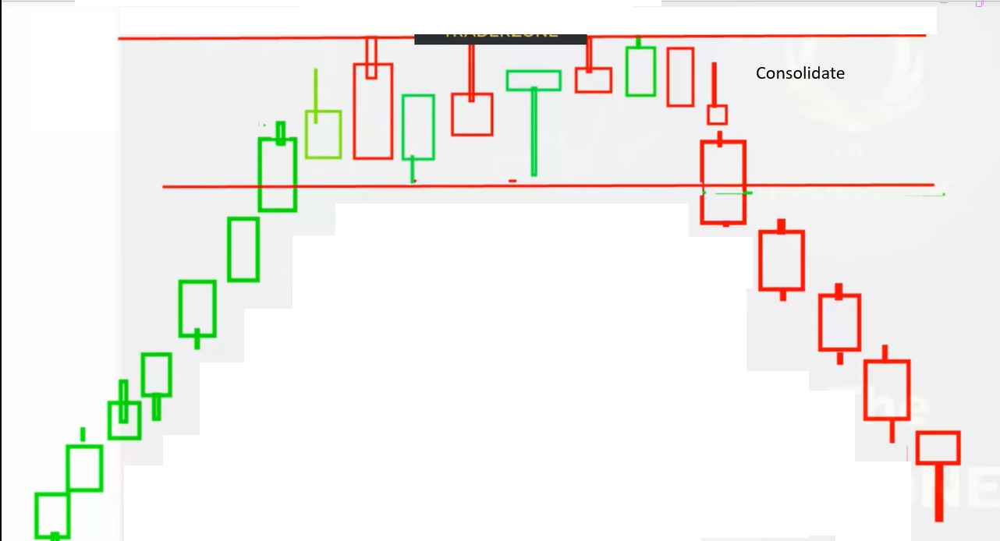
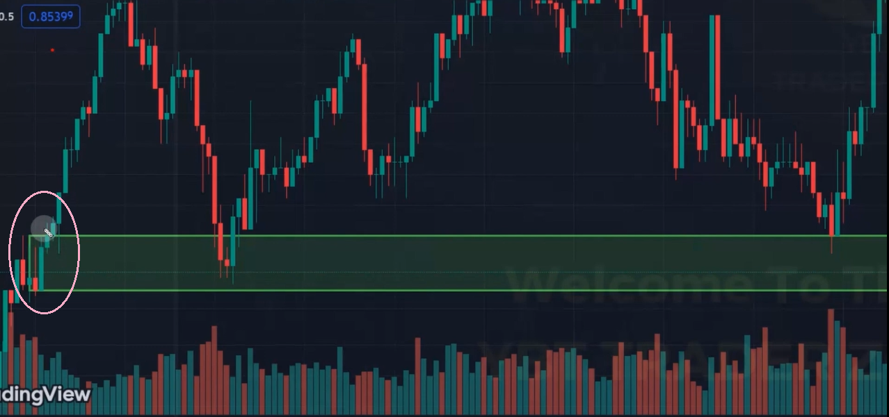
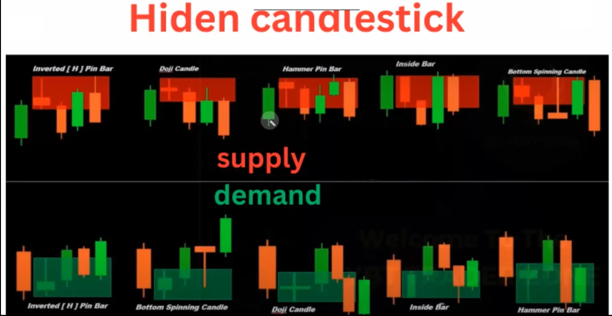
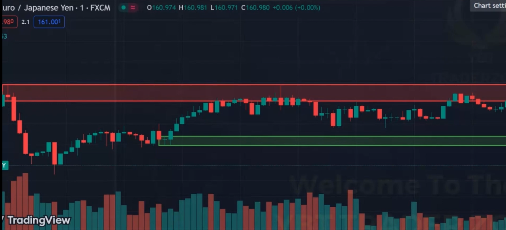

# Supply and Demand Zone

There are three types to mark the zone

## Type 1

- First find the consolidate zone and mark

## Type 2

- First find the aggressive buying or selling and mark the started or first candle as zone

## Type 3

- Using Hiden Candlestick

### For eg

